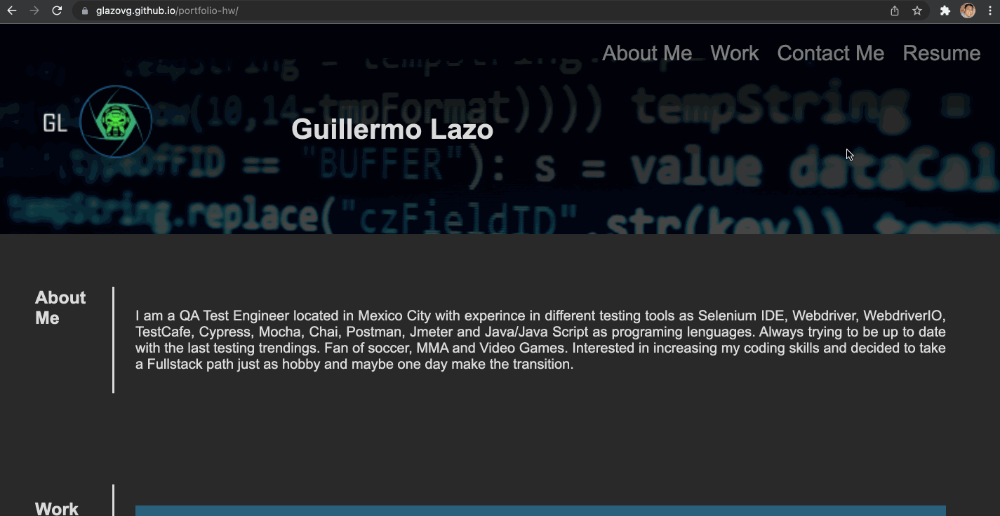
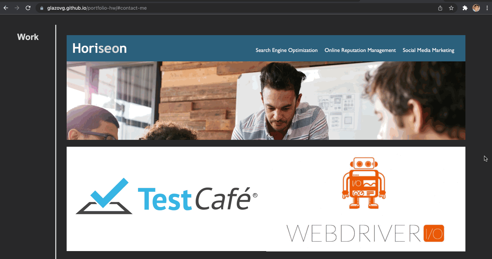

# Portfolio
Porfolio project includes three sections:
 1. About Me - A brief developer bio description.
 2. Work - Developer's applications.
 3. Contact Me - A way to contact with the developer.

 ## Rules
 Navigation bar section, each link takes to the specific section.
\
\

\
\
 Work section, first project is larger than the others and when a project is visited by clicking on "View Project" a new tab is open with the developed project.
\
\

\
\
 Finally the application should be responsiveness, so if the screen is resized the application adapts to the viewport.
\
\

\
\
[Portfolio Web Site](https://glazovg.github.io/portfolio-hw/)

Developed by Guillermo Lazo